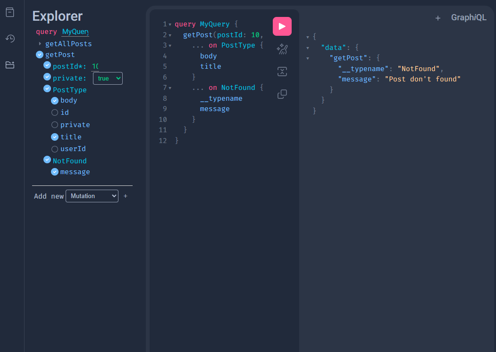

## Backend homework

This project is Pokemon blog!
Here you can post your tougths about everything that you like from Pokemon. You can post public or private posts.

### API
The API have an endpoint to signin and signup. Also other endpoints where you can update some personal info, activate the account and delete the account.
For default the account is already activated, and for this example, don't matter if the user is activated or not.

To get better approach to the API you can access to the documentation using the [Swagger](http://localhost:8000/docs) or if you prefer the other format of documentation you can use this [link](http://localhost:8000/redoc).

The endpoint for create/visualize the post are made in GraphQL, so the link is a little different. [GraphQL](http://localhost:8000/graphql) have a different visualization from the Rest API.


.

### Technology

The backend is created using FastAPI and the GraphQL endpoint with strawberry-GraphQL.

The service run using docker.

The database that is used is a PostgreSQL.


## Use

To use this service, first we need to build and up the image. When the service is up, this will create two images (API, Database). With any of the link from above you can access to the API and the GraphQL server.

To signup in the blog post you need to use the endpoint `/users/signup` 


To login you can use the endpoint `/auth/token` or the button `Authorize`. The endpoint `/auth/token` return the Bearer token, but also create a cookie with the time and the sub that contain the:
- role
- user id
- username

If you want to retrieve/create any post you can do it sending a query using the GraphQL language or use the server of strawberry.

### Create Post

To create a new post, you need to create a new mutation. In this mutation you can create/update any post, if you are the own of the post you can update it.

In this part you can define if the post created could be private or public, setting the flag `private` to True/False.

### Retrieve Posts

In this function, you can retrieve all the post or a single post. When you retrieve a post you need to know the id of the post and if the post is private or public. In this part is important always retrieve the `NotFound` response, to have a good experience.


## Master User/Password
The master user is `admin` and the password is `TalkAboutPokemon!`.


## .env
This app have two `.env` files, one for the database and one for the secret used in the JWT.

.database.env

```.env
drivername = postgresql+asyncpg
username=postgres
password=postgres
host=pg
database=pokebase
port=5432
```

.secret.env

```.env
secret_key = 9085b80b8d587a5b9f32d25162b402ed6fd006b3acf061db
```


## Random number

Also you can retrieve a random number from this [endpoint](http://localhost:8000/get_random_number)